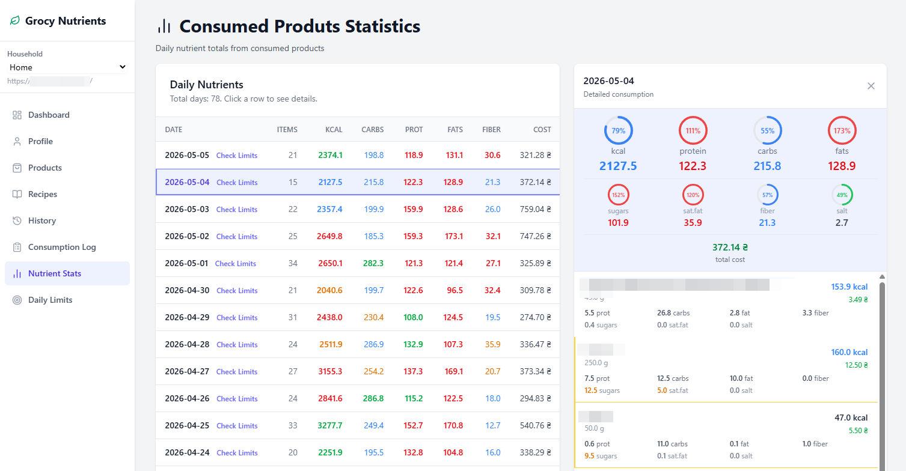
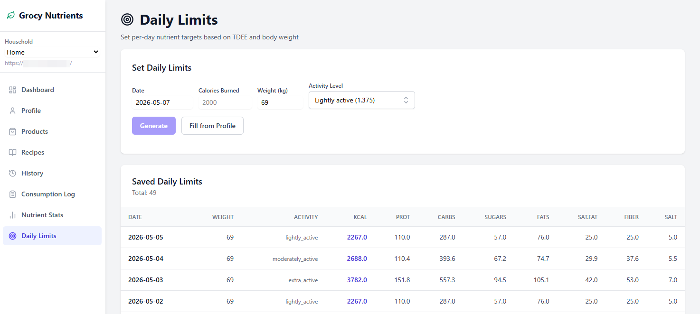
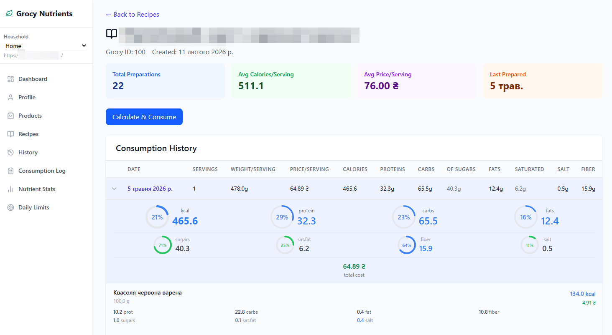

# Grocy Nutrients

*Nutrition tracking and consumption analytics for Grocy.*

Turn your self-hosted [Grocy](https://grocy.info) instance into a daily nutrition tracker — log what you actually ate, set per-day calorie / protein / fat / carb targets, and analyze recipe nutrient breakdowns and consumption history over time. An optional household mode lets multiple people share a single Grocy account, each with their own goals and credentials.

*FastAPI + Vue 3. Per-user Grocy API keys are encrypted at rest with [Themis SCellSeal](https://docs.cossacklabs.com/themis/crypto-theory/cryptosystems/secure-cell/), keyed by the user's bcrypt hash — so the database alone doesn't reveal them.*



---

## Features

### Daily nutrition tracking & limits

Set per-day calorie / protein / fat / carb / sugar / fiber / salt targets — generated from your weight, activity level, and TDEE, or filled in from your health profile. Each user keeps their own history of saved limits, so targets can evolve over time without losing the record.



### Recipes, consumption & analytics

Open any recipe to see its rolling stats — total preparations, average calories and price per serving, last prepared date — then drill into the full consumption history with the nutrient breakdown and per-ingredient cost for every preparation. One click logs a new consumption back to Grocy. See [RECIPE_NUTRIENTS.md](./RECIPE_NUTRIENTS.md) for the calculation algorithm and consumption flow in detail.



### Multi-user household mode

A single Grocy instance can be shared across household members, each with their own login, encrypted API key, and individual nutrition goals — without exposing the Grocy admin API key to anyone.

### Auth & account management

Email-based registration, JWT auth with refresh tokens, password reset over SMTP, and self-service account deletion.

---

## ⚠️ Heads up

This tool writes to your Grocy instance through its API — it consumes recipes, updates product nutrients, and creates shopping lists. Back up your Grocy data before first use. The author provides no warranty (see [LICENSE](./LICENSE)).

Auth tokens live in HttpOnly cookies (`__Host-access_token` in production, plus a refresh cookie scoped to `/api/auth`) — they cannot be read by JavaScript, which protects them from XSS exfiltration. Production deployments must serve frontend and backend from the same origin (see [docker/nginx-frontend.conf](./docker/nginx-frontend.conf), which proxies `/api/*` to the backend) so `SameSite=Strict` cookies travel correctly.

---

## Architecture highlights

### Per-user encrypted Grocy API keys

Each user's Grocy API key is stored encrypted at rest with [Themis SCellSeal](https://docs.cossacklabs.com/themis/crypto-theory/cryptosystems/secure-cell/), using the user's own bcrypt password hash as the encryption key. There is no global master key in the system — a database leak alone doesn't expose any API keys, since the attacker would still need each user's password hash. When a user changes their password, all of that user's API keys are transparently re-encrypted under the new hash.

### Household-aware FastAPI dependency

Grocy API keys are stored per-`(user, household)` pair in the `HouseholdUser` join table. A single FastAPI dependency, `get_grocy_api`, validates active membership in the requested household, decrypts the user's API key for that household, and returns a configured Grocy client — so route handlers stay free of authz and crypto details:

```python
@router.get("/products")
async def list_products(grocy: GrocyAPI = Depends(get_grocy_api)):
    return await grocy.get_products()
```

### Background sync via Celery + Redis

Products and recipes are pulled from Grocy daily at 04:00 by a Celery beat job and cached locally in PostgreSQL, so chart-heavy views (consumption stats, recipe nutrient breakdowns) stay snappy without hammering the upstream Grocy API on every request. The same worker handles range-checked nutrition-limit notifications over email.

---

## Tech stack

**Backend:** FastAPI · SQLModel · PostgreSQL · Redis · Celery · Themis · Alembic
**Frontend:** Vue 3 · TypeScript · Pinia · Vue Router · Tailwind CSS · Vite
**Infra:** Docker Compose · GitHub Actions

---

<details>
<summary><strong>Run it locally</strong></summary>

**Prerequisites:** Docker and Docker Compose.

```bash
git clone https://github.com/yura1106/grocy-nutrients.git
cd grocy-nutrients
cp .env.backend.example .env.backend
# Edit .env.backend — at minimum set JWT_SECRET_KEY.
# To enable password reset emails, fill in the SMTP_* variables.
make up
```

Open the app:
- Frontend: http://localhost:5173
- API docs (Swagger UI, schema viewer): http://localhost:5173/api/docs — open after logging in; auth flows through your session cookie automatically.

After registering, create a household and enter your Grocy URL and API key in the form. If your Grocy instance runs on a private network (e.g. `192.168.x.x`), set `ALLOW_PRIVATE_GROCY_URL=True` in `.env.backend`.

Common make targets: `make migrate`, `make lint-python`, `make lint-js`, `make ci`.

</details>

---

## Roadmap

- [ ] Meal plan management — schedule meals ahead, see projected nutrient intake against targets
- [ ] Backend refactoring pass — service-layer cleanup, unified error handling

---

## License

[MIT](./LICENSE)

## Author

Built by **Yurii Kuznietsov** — [GitHub](https://github.com/yura1106) · [LinkedIn](https://www.linkedin.com/in/yurakuznetsov1106/)

---

*Grocy Nutrients is an independent companion project and is not affiliated with the [Grocy](https://grocy.info) project.*
